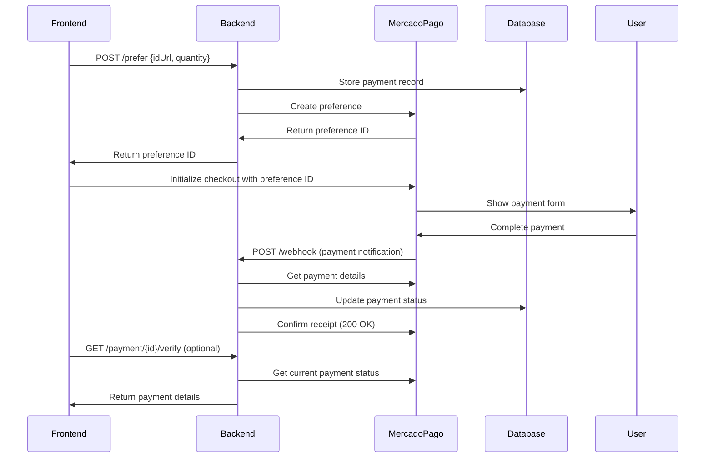

# MercadoPago Checkout Pro - Backend Integration Guide

## 📋 Overview

This document outlines the complete MercadoPago Checkout Pro backend implementation for the frontend development team. All required endpoints and webhook handling are implemented and ready for frontend integration.

## 🚀 Implemented Features

### ✅ Payment Creation
- **Endpoint**: `POST /prefer`
- **Status**: ✅ Implemented
- **Security**: Rate limiting, input validation, error handling

### ✅ Webhook Notifications
- **Endpoint**: `POST /webhook`
- **Status**: ✅ Implemented
- **Security**: Signature validation, automatic status updates

### ✅ Payment Verification
- **Endpoint**: `GET /payment/:id/verify`
- **Status**: ✅ Implemented
- **Purpose**: Manual payment status checking

### ✅ Database Integration
- **Status**: ✅ Implemented
- **Features**: Payment storage, status updates, Firebase integration

---

## 🔌 API Endpoints

### 1. Create Payment Preference

Creates a new payment preference for MercadoPago Checkout Pro.

```http
POST /prefer
Content-Type: application/json

{
  "idUrl": "string",     // Required: URL identifier
  "quantity": number     // Required: Quantity (positive integer)
}
```

**Success Response (201):**
```json
{
  "id": "1234567890"  // MercadoPago preference ID
}
```

**Error Responses:**
```json
// Missing fields (400)
{
  "error": "Missing required fields: idUrl and quantity are required"
}

// Invalid quantity (400)
{
  "error": "Quantity must be a positive integer"
}

// Server error (500)
{
  "error": "Failed to create payment preference"
}
```

### 2. Payment Verification

Manually verify payment status and sync with MercadoPago API.

```http
GET /payment/{paymentId}/verify
```

**Success Response (200):**
```json
{
  "id": "1234567890",
  "status": "approved",
  "status_detail": "accredited",
  "transaction_amount": 9.90,
  "currency_id": "BRL",
  "date_created": "2023-01-01T10:00:00.000Z",
  "date_last_updated": "2023-01-01T10:05:00.000Z"
}
```

**Error Responses:**
```json
// Payment not found (404)
{
  "error": "Payment not found"
}

// Server error (500)
{
  "error": "Failed to verify payment"
}
```

### 3. Webhook Endpoint

Receives automatic payment notifications from MercadoPago (internal use).

```http
POST /webhook
Content-Type: application/json
x-signature: ts=1234567890,v1=abc123...

{
  "type": "payment",
  "data": {
    "id": "1234567890"
  }
}
```

---

## 🔐 Security Implementation

### Rate Limiting
- **Limit**: 10 requests per 15 minutes per IP
- **Headers**: `RateLimit-*` headers included
- **Protection**: Against abuse and DDoS

### Webhook Security
- **Signature Validation**: HMAC-SHA256 verification
- **Environment Variable**: `MP_WEBHOOK_SECRET`
- **Timestamp Validation**: Prevents replay attacks

### Input Validation
- Required field validation
- Data type validation
- Range validation for quantities
- Environment variable validation

---

## 🎯 Frontend Integration Guide

### Step 1: Create Payment Preference

```javascript
// Frontend - Create payment preference
const createPayment = async (urlId, quantity) => {
  try {
    const response = await fetch('/prefer', {
      method: 'POST',
      headers: {
        'Content-Type': 'application/json',
      },
      body: JSON.stringify({
        idUrl: urlId,
        quantity: quantity
      })
    });

    if (!response.ok) {
      const error = await response.json();
      throw new Error(error.error);
    }

    const { id } = await response.json();
    return id; // MercadoPago preference ID
  } catch (error) {
    console.error('Payment creation failed:', error);
    throw error;
  }
};
```

### Step 2: Initialize MercadoPago Checkout

```javascript
// Frontend - Initialize MercadoPago Checkout Pro
const initMercadoPago = async (preferenceId) => {
  const mp = new MercadoPago('YOUR_PUBLIC_KEY', {
    locale: 'pt-BR'
  });

  // Create checkout
  mp.checkout({
    preference: {
      id: preferenceId
    },
    autoOpen: true
  });
};
```

### Step 3: Handle Payment Status

```javascript
// Frontend - Verify payment status
const verifyPayment = async (paymentId) => {
  try {
    const response = await fetch(`/payment/${paymentId}/verify`);

    if (!response.ok) {
      throw new Error('Payment verification failed');
    }

    const paymentData = await response.json();
    return paymentData;
  } catch (error) {
    console.error('Payment verification error:', error);
    throw error;
  }
};

// Check payment status
const checkPaymentStatus = (status) => {
  switch (status) {
    case 'approved':
      return 'Payment approved ✅';
    case 'pending':
      return 'Payment pending ⏳';
    case 'rejected':
      return 'Payment rejected ❌';
    case 'cancelled':
      return 'Payment cancelled ❌';
    default:
      return 'Unknown status ❓';
  }
};
```

---

## ⚙️ Environment Configuration

Required environment variables:

```bash
# MercadoPago Configuration
MP_ACCESS_TOKEN=your_access_token_here
MP_WEBHOOK_SECRET=your_webhook_secret_here
TRANSACTION_AMOUNT=9.90

# Application URLs
BASE_URL=https://yourdomain.com

# Firebase Configuration
FIREBASE_PROJECT_ID=your_project_id
FIREBASE_PRIVATE_KEY=your_private_key
FIREBASE_CLIENT_EMAIL=your_client_email
# ... other Firebase vars
```

---

## 🔄 Payment Flow



---

## 🧪 Testing

### Test Payment Creation
```bash
curl -X POST http://localhost:8888/prefer \
  -H "Content-Type: application/json" \
  -d '{
    "idUrl": "test-url-123",
    "quantity": 1
  }'
```

### Test Payment Verification
```bash
curl -X GET http://localhost:8888/payment/1234567890/verify
```

---

## 📊 Payment Status Reference

| Status | Description | Action Required |
|--------|-------------|----------------|
| `pending` | Payment initiated but not completed | Wait for completion |
| `approved` | Payment successfully processed | Grant access/service |
| `rejected` | Payment was declined | Request new payment |
| `cancelled` | Payment was cancelled by user | Request new payment |
| `refunded` | Payment was refunded | Revoke access/service |

---

## 🚨 Error Handling

### Common Error Scenarios

1. **Invalid Input**: Frontend should validate before sending
2. **Network Issues**: Implement retry logic with exponential backoff
3. **Payment Failures**: Show user-friendly error messages
4. **Timeout**: Set appropriate request timeouts (30s recommended)

### Recommended Frontend Error Handling

```javascript
const handlePaymentError = (error) => {
  if (error.message.includes('Missing required fields')) {
    // Show validation error to user
    showValidationError('Please fill all required fields');
  } else if (error.message.includes('MercadoPago API error')) {
    // Show payment provider error
    showPaymentError('Payment service temporarily unavailable');
  } else {
    // Generic error
    showGenericError('Something went wrong. Please try again.');
  }
};
```

---

## 🎉 Implementation Status

| Component | Status | Notes |
|-----------|--------|-------|
| Payment Creation | ✅ Complete | Ready for frontend integration |
| Webhook Handling | ✅ Complete | Automatic status updates working |
| Payment Verification | ✅ Complete | Manual sync available |
| Database Integration | ✅ Complete | Firebase storage implemented |
| Error Handling | ✅ Complete | Comprehensive error responses |
| Security | ✅ Complete | Rate limiting + signature validation |
| Documentation | ✅ Complete | This document |

---

## 🤝 Frontend Team Next Steps

1. **Environment Setup**: Configure MercadoPago public key
2. **UI Implementation**: Create payment forms and status pages
3. **Integration**: Use the provided API endpoints
4. **Testing**: Test with MercadoPago sandbox environment
5. **Error Handling**: Implement user-friendly error messages
6. **Status Monitoring**: Add payment status checking

**The backend is production-ready and waiting for frontend integration! 🚀**

---

*Generated for arrasta-backend MercadoPago integration - Ready for frontend development*